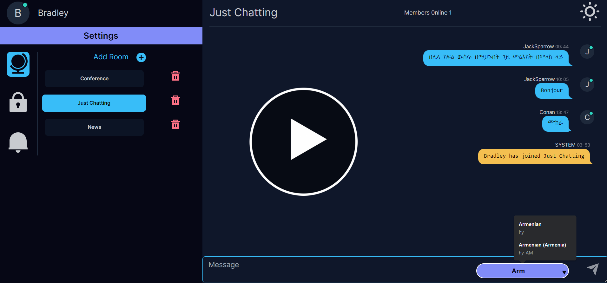

# Babel-Chat - Realtime Chat App with Live Translation

<h1 align='center' color='blue'>BABEL CHAT</h1>

    

* [About](#about)
* [Demo](#demo)
* [Features](#features)
* [Technologies used](#technologies-used)
* [Important Path Descriptions](#important-path-descriptions)
* [Liscence](#license)
* [Blog](#blog)
* [Credits](#credits)

## About

This is a web-based realtime chat application that allows users to communicate seamlessly across language barriers. Powered by advanced translation capabilities, users can send and receive messages in their preferred language while the app automatically translates the messages in real-time.

## Demo

## Features

- ### Realtime chat functionality
  * Babel Chat utilizes the socket.io library to enable real time communication over the web
- ### Live translation of messages
  * the google-translate-api-x library is build ontop of googles translation api allowing for less rate limiting with free use using batch translations
- ### User-friendly interface
  * The interface was designed with inspiration from Slack and Discord allowing for users to be familiar with the layout
- ### Support for multiple languages
  * The application supports all languages supported by google translate

## Technologies used

### Backend

- **Express**: A minimal and flexible Node.js web application framework utilized for building the server-side logic.
- **Socket.io**: Enables real-time, bidirectional, and event-based communication between web clients and servers.
- **Swagger**: API documentation tool used for documenting the RESTful APIs of the application.
- **google-translate-api-x**: A translation API library integrated for translating messages in real-time.

### Frontend

- **Svelte**: A modern JavaScript framework utilized for building interactive user interfaces.
- **Tailwind CSS**: A utility-first CSS framework for rapidly building custom designs without having to leave your HTML.
- **Daisy UI**: A set of configurable components built on top of Tailwind CSS, used for enhancing UI design.

## API Documentation

API documentation is available using Swagger. Once the server is running, access <a href='https://bchat-1-0.onrender.com/api'>https://bchat-1-0.onrender.com/docs</a> to view the API documentation.

## Contributing

Contributions are welcome! Feel free to open issues or submit pull requests.

## Credits

* [Custom Alerts - SweetAlert2](https://sweetalert2.github.io/)
* [Badges - Shields.io](https://shields.io)
* [Icons - remixicon.com](https://remixicon.com)

## Blog

    
    

